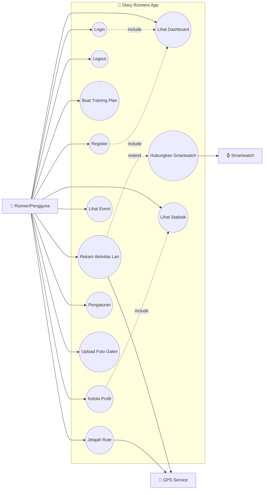
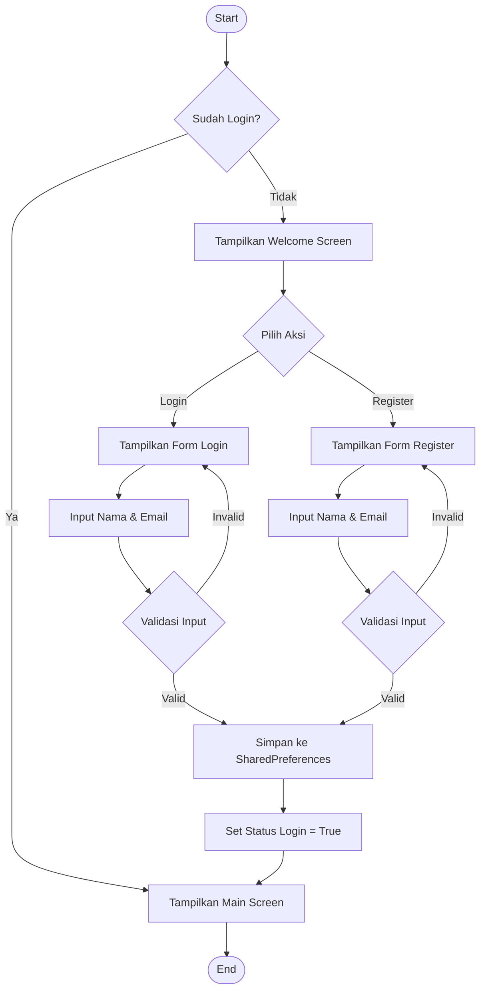
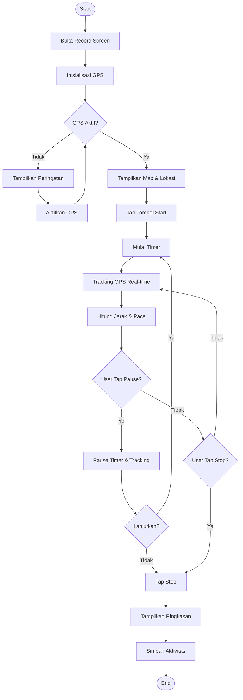
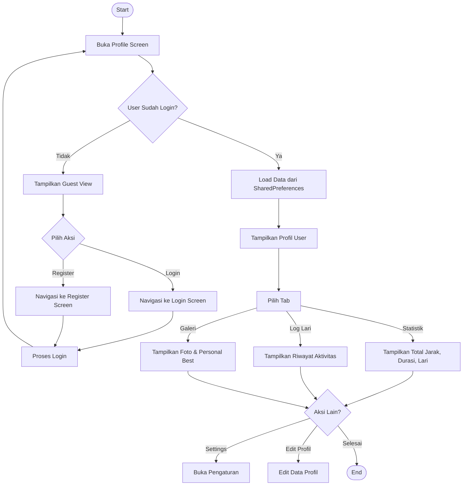
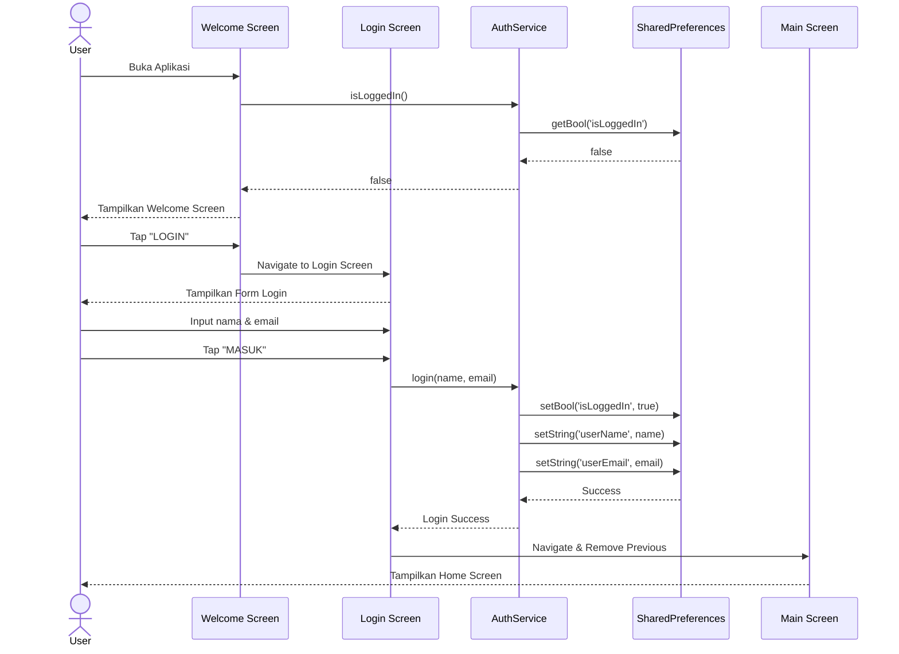
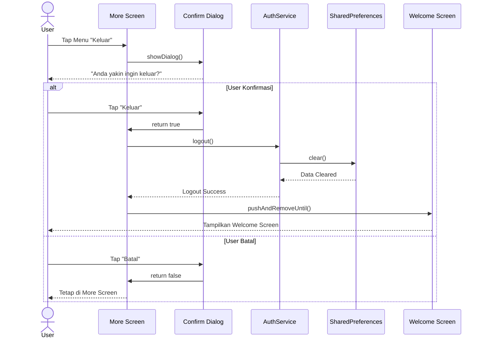
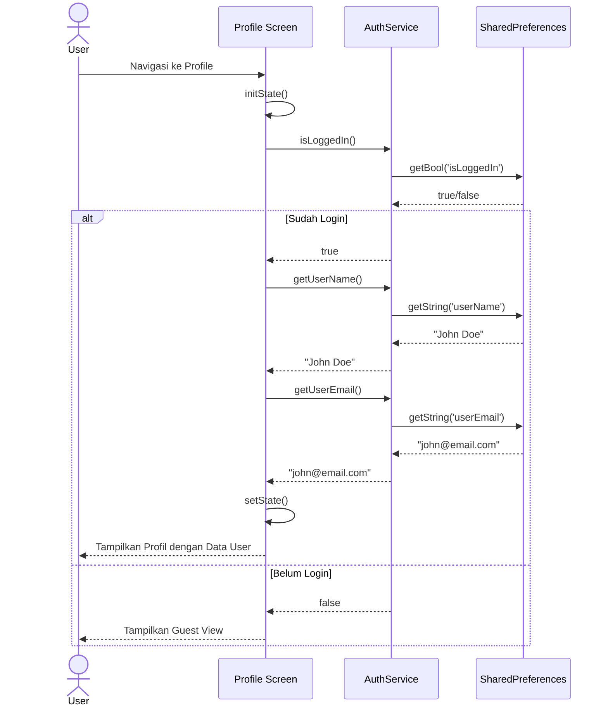
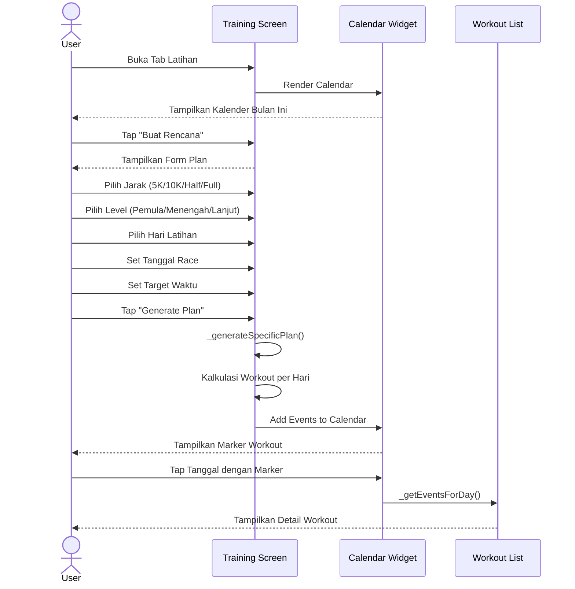

# UML Diagrams - Diary Runners

Dokumentasi diagram UML lengkap untuk aplikasi **Diary Runners**.

---

## 1. Use Case Diagram

### Penjelasan Use Case

| Use Case | Aktor | Deskripsi |
|----------|-------|-----------|
| **UC1: Login** | Pengguna | User memasukkan nama dan email untuk masuk ke aplikasi |
| **UC2: Register** | Pengguna | User baru mendaftar dengan mengisi nama dan email |
| **UC3: Logout** | Pengguna | User keluar dari akun dan kembali ke Welcome Screen |
| **UC4: Lihat Dashboard** | Pengguna | Melihat ringkasan aktivitas, jadwal latihan, dan statistik di Home |
| **UC5: Buat Training Plan** | Pengguna | Membuat rencana latihan dengan kalender dan workout schedule |
| **UC6: Rekam Aktivitas Lari** | Pengguna, GPS | Merekam aktivitas lari dengan GPS tracking, timer, dan pace |
| **UC7: Jelajah Rute** | Pengguna, GPS | Mencari dan melihat rute lari populer dengan detail elevasi |
| **UC8: Lihat Event** | Pengguna | Melihat daftar event/kompetisi lari mendatang |
| **UC9: Kelola Profil** | Pengguna | Melihat dan mengedit profil, data fisik, foto |
| **UC10: Pengaturan** | Pengguna | Mengatur notifikasi, bahasa, tema, dan keamanan |
| **UC11: Hubungkan Smartwatch** | Pengguna, Smartwatch | Menghubungkan perangkat wearable untuk sync data |
| **UC12: Lihat Statistik** | Pengguna | Melihat statistik lari (jarak, durasi, pace, log lari) |
| **UC13: Upload Foto Galeri** | Pengguna | Mengunggah foto lari ke galeri profil |

---

## 2. Activity Diagram

### 2.1 Activity Diagram - Login/Register Flow

#### Penjelasan Aktivitas Login/Register:

| Step | Aktivitas | Penjelasan |
|------|-----------|------------|
| 1 | **Cek Status Login** | Aplikasi mengecek SharedPreferences apakah user sudah login sebelumnya |
| 2 | **Tampilkan Welcome/Main** | Jika sudah login → Main Screen, jika belum → Welcome Screen |
| 3 | **Pilih Login/Register** | User memilih untuk masuk atau daftar baru |
| 4 | **Input Data** | User mengisi nama dan email |
| 5 | **Validasi** | Sistem memvalidasi input tidak kosong |
| 6 | **Simpan Data** | Data disimpan ke SharedPreferences (isLoggedIn, userName, userEmail) |
| 7 | **Navigasi ke Main** | User diarahkan ke halaman utama aplikasi |

---

### 2.2 Activity Diagram - Rekam Aktivitas Lari

#### Penjelasan Aktivitas Rekam Lari:

| Step | Aktivitas | Penjelasan |
|------|-----------|------------|
| 1 | **Buka Record Screen** | User masuk ke halaman rekam aktivitas |
| 2 | **Inisialisasi GPS** | Sistem mengaktifkan layanan lokasi dan GPS |
| 3 | **Cek GPS** | Validasi apakah GPS sudah aktif dan mendapat sinyal |
| 4 | **Tampilkan Map** | Menampilkan peta dengan lokasi user saat ini |
| 5 | **Tap Start** | User menekan tombol mulai untuk memulai rekam |
| 6 | **Mulai Timer** | Timer mulai berjalan menghitung durasi lari |
| 7 | **Tracking GPS** | Sistem melacak posisi user secara real-time |
| 8 | **Hitung Jarak & Pace** | Kalkulasi jarak tempuh dan pace per kilometer |
| 9 | **Pause/Resume** | User bisa pause dan lanjutkan tracking |
| 10 | **Stop & Simpan** | User menyelesaikan lari, data disimpan ke log |

---

### 2.3 Activity Diagram - Lihat Profil

#### Penjelasan Aktivitas Lihat Profil:

| Step | Aktivitas | Penjelasan |
|------|-----------|------------|
| 1 | **Buka Profile** | User navigasi ke halaman profil |
| 2 | **Cek Login State** | Sistem cek apakah user sudah login via AuthService |
| 3 | **Guest View** | Jika belum login, tampilkan prompt untuk login/register |
| 4 | **Load Data** | Ambil nama dan email dari SharedPreferences |
| 5 | **Tampilkan Profil** | Menampilkan foto, nama, email, dan stat fisik |
| 6 | **Tab Statistik** | Total jarak, durasi, jumlah lari |
| 7 | **Tab Log Lari** | Riwayat aktivitas lari dengan detail |
| 8 | **Tab Galeri** | Foto-foto lari dan catatan Personal Best |

---

## 3. Sequence Diagram

### 3.1 Sequence Diagram - Login Process

#### Penjelasan Sequence Login:

| Step | Interaksi | Penjelasan |
|------|-----------|------------|
| 1 | User → App | User membuka aplikasi Diary Runners |
| 2 | App → AuthService | Aplikasi mengecek status login |
| 3 | AuthService → SharedPreferences | Query data login dari local storage |
| 4 | SharedPreferences → AuthService | Return false (belum login) |
| 5 | App → User | Tampilkan Welcome Screen dengan tombol Login/Register |
| 6 | User → Login Screen | User tap tombol LOGIN |
| 7 | User → Form | User mengisi nama dan email |
| 8 | Login Screen → AuthService | Panggil method login() |
| 9 | AuthService → SharedPreferences | Simpan status dan data user |
| 10 | App → Main Screen | Navigasi ke Main Screen setelah login berhasil |

---

### 3.2 Sequence Diagram - Logout Process

#### Penjelasan Sequence Logout:

| Step | Interaksi | Penjelasan |
|------|-----------|------------|
| 1 | User → More Screen | User tap menu "Keluar" |
| 2 | App → Dialog | Tampilkan dialog konfirmasi |
| 3 | User → Konfirmasi | User memilih "Keluar" atau "Batal" |
| 4 | AuthService → SharedPreferences | Hapus semua data login dengan clear() |
| 5 | App → Welcome Screen | Navigasi kembali ke Welcome dan hapus semua route |

---

### 3.3 Sequence Diagram - View Profile

#### Penjelasan Sequence View Profile:

| Step | Interaksi | Penjelasan |
|------|-----------|------------|
| 1 | User → Profile Screen | User membuka halaman profil |
| 2 | initState() | Screen melakukan inisialisasi |
| 3 | Check Login | Cek status login dari AuthService |
| 4 | Load User Data | Jika login, ambil nama dan email dari SharedPreferences |
| 5 | setState() | Update UI dengan data yang sudah diload |
| 6 | Render | Tampilkan profil atau guest view |

---

### 3.4 Sequence Diagram - Create Training Plan

#### Penjelasan Sequence Training Plan:

| Step | Interaksi | Penjelasan |
|------|-----------|------------|
| 1 | User → Training Screen | Buka tab Latihan di bottom nav |
| 2 | Render Calendar | Tampilkan kalender dengan tanggal yang bisa diklik |
| 3 | Buat Rencana | User memulai pembuatan training plan baru |
| 4 | Input Parameter | Pilih jarak, level, hari latihan, tanggal race, target waktu |
| 5 | Generate Plan | Sistem menghitung dan membuat jadwal workout |
| 6 | Update Calendar | Marker workout ditambahkan ke tanggal yang sesuai |
| 7 | Lihat Detail | User tap tanggal untuk melihat detail workout hari itu |

---

## 📋 Ringkasan Diagram

| Diagram | Jumlah | Fokus |
|---------|--------|-------|
| **Use Case** | 1 | 13 Use Cases dengan 3 Aktor |
| **Activity** | 3 | Login/Register, Rekam Lari, Lihat Profil |
| **Sequence** | 4 | Login, Logout, View Profile, Training Plan |

---

*Dokumentasi UML - Diary Runners v1.0.0*
